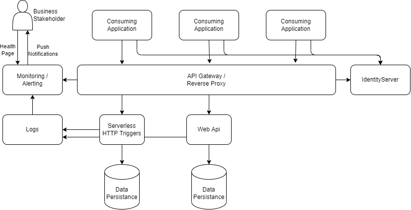

# Summary
A description of the components that go into a service layer and what I consider an ideal structure.

# Components
## API Gateway / Reverse Proxy
  The gateway is responsible for routing traffic from a consistent client facing set of endpoints to the microservices that can be used to process the requests.
  This can handle authenticating the user or that can be passed through to the individual applications; I don't hold a strong opinion at this time. 
  For a free service Microsoft has provided the YARP base for us to build on. Oscelot can be used as a free base but lacks some functionality as it's only an API Gateway.
## Monitoring / Alerting
  Responsible for notifying business personel(stakeholders) when a system is not performing as expected.
  Contains a health status spash page indicating at stoplight level(green, yellow, red) how the suite of services offered is performing.
  Can also notify contacts from calling application but with sanitized messages that only notify of an issue being encountered. 
  Prometheus is an open source Monitoring/Alerting system that can be used. YARP has a pre-built integration with Prometheus.
  Information about the Http Status of responses should flow to the Monitoring / Alerting system for visibility on how many requests are processing successfully (HTTP 2xx)
## Service
  Responsible for processing the requested action.
  Ideally these are microservices seperated by units of work but can be monoliths. As monoliths mature, they tend to loose their healthy layers and become unstable. A unit of work should be broken out into a microservice from a monolith when a change cannot be tested at the atomic unit that is changing and requires regression testing from the whole application. The first step no matter the structure is to implement an API Gateway / Reverse Proxy to remove the calling applications from being dependant on where the unit of work occurs.
  Can be either a WebApi(.net, node, etc) for persistent execution or serverless (azure functions, aws lambda, etc) for intermittent executions. Azure Functions can be run from on-prem K8s instances using KEDA.
## Persistence
  Should contain the state of the unit of work/domain(ie. contains most of the information about orders, or about products, etc )
  Can be any form of persistance but for most business functionality you are likely using structured data and a SQL server. Document Dbs are also possible but come with their own pro's and con's that I'm not getting into here.
## Logs
  Centralized Log storage that contains all errors or informational records that were generated from the suite of applications while executing. A spike in errors can indicate a service issue just as much as a slew of HTTP 5xx can.