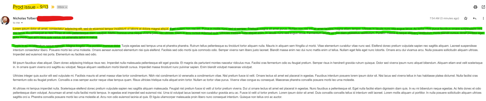
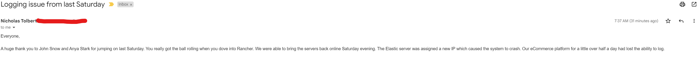
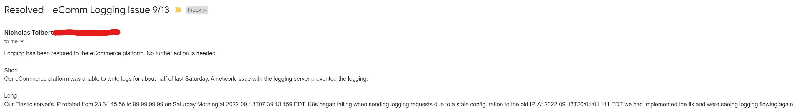

# Summary
Have you ever needed to send an email that could get passed around to technical staff as well as upper level management? What about to BAs and devs?
Have these emails ever had difficulty because they lacked focus?
Most emails tend to focus on the level of detail that the writer knows instead of the reader.
When writing that next email, here are a couple tips to make sure each group is provided for.

## How much of an email does someone read?
We can create a long and detailed workup for any issues that are encountered but they provide no value if they aren't consumed.

How much of your email is read:
An executive(Yellow) - An executive may only read the title of your email. If they read more they are doing so from the top of the email and will only get one or two sentences in before again determining if the rest of the email requires their attention.
A busy Manager(Green) - Someone who is reading for information will digest the whole first paragraph and may skim the rest of the article to understand the email at a high level.
A BA or Developer - The entire email but will understand terms and technical descriptions differently

## Levels of granularity
Many times non-technical staff may send an email that looks like the following. It is great to convey business related value of an issue and can be read easily by anyone. The downside is that if this email is passed to technical staff as the basis of changes to make to the system, there is no information to go on and a dev will spend hours re-finding information about the prod issue.

Many times technical staff will write an email that looks like the following. It is packed with all the details of the issue incase they are needed in the future. The downside is that the email is basically unreadable from non-technical staff(BAs, Managers). It is difficult to determine if the issue is resolved or what impact the business will see without reading the email.

## Proposed Solution
A real instance of this email normally results in the "short" section being a long paragraph and the "long" section is a full page of text. The example is only to highlight the structure.

Structure
- Summarize the entire email in the title and first sentence of the email - That way it is easy to digest the current state of the issue and understand the impact.
- Provide a "short", less technical section that details the issue
- Provide the "long", technical details lastly. Include any piece of information you had to lookup or that could be referenced for someone to do further investigation

